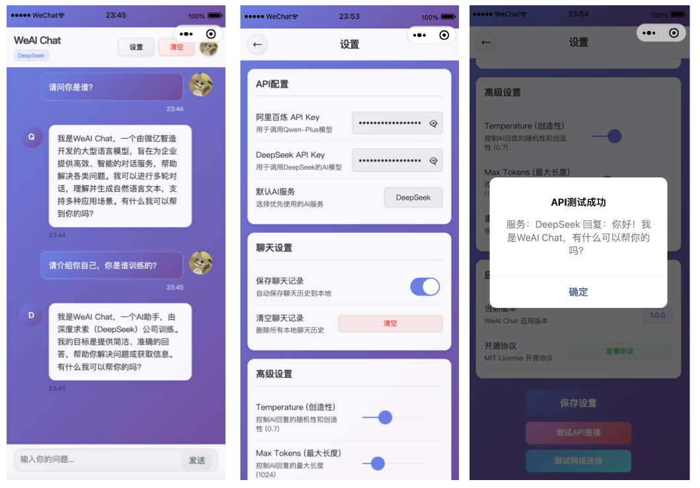

# WeAI Chat: An open-source lightweight AI chat WeChat Mini Program

一个基于微信小程序的AI对话应用，支持多种AI模型，提供智能对话服务。

## Software Features

- 🎨 **简洁美观的UI设计** - 采用现代化渐变背景和GUI
- 💬 **流畅的对话体验** - 支持实时消息发送和接收
- 🤖 **多AI服务支持** - 支持阿里百炼Qwen-Plus和DeepSeek模型

## Interface Preview



## Files Structure

```zsh
├── pages/
│   ├── index/              # 主聊天页面
│   │   ├── index.wxml      # 页面结构
│   │   ├── index.wxss      # 页面样式
│   │   ├── index.js        # 页面逻辑
│   │   └── index.json      # 页面配置
│   └── settings/           # 设置页面
│       ├── settings.wxml   # 设置页面结构
│       ├── settings.wxss   # 设置页面样式
│       ├── settings.js     # 设置页面逻辑
│       └── settings.json   # 设置页面配置
├── imgs/                   # 图片资源
├── config/
│   └── api.js              # API配置文件
├── app.js                  # 应用入口
├── app.json                # 应用配置
├── app.wxss                # 应用样式
└── README.md               # 项目说明
```

## TODOLIST

- [ ] 支持更多模型

- [ ] 支持文生图模型

- [x] 支持上下文引导

- [x] 支持常用提示词

- [x] 修复markdown渲染bug

- [x] 支持夜间模式

## Update History

### v1.4.3

* 🛠️ 修复阿里百炼流式API内容提取问题
* 🛠️ 优化消息解析和流式输出逻辑
* 🔧 改进API测试功能的可靠性
* 📝 增强错误处理和日志输出

### v1.4.2

* 🛠️ 修复API测试连接问题
* 🛠️ 修复消息解析格式问题
* 🎨 优化GitHub按钮夜间模式显示
* 🔗 添加GitHub仓库访问功能

### v1.4.1

- 🛠️ 修复个性化设置UI bug

### v1.4.0

- 🛠️ 修复 UI bug  
- 🎨 UI 优化  
- 🗨️ 添加对话模式  
- 📋 支持文本复制和Markdown复制  
- 🎛️ 支持个性化设置

### v1.3.1

- 😊 支持显示模型和用户ID

### v1.3.0

- 💬 支持上下文

### v1.2.0

- 🌃 支持夜间模式

### v1.1.0

- ⭐️ 支持markdown渲染

### v1.0.0

- 🎉 初始版本发布
- 🤖 支持Qwen-Plus和DeepSeek
- 💬 基础聊天功能
- ⚙️ 设置管理功能

## Cite

使用[wemark](https://github.com/TooBug/wemark)组件以支持markdown渲染

## Contribution

本项目采用MIT开源协议，欢迎提交Issue和Pull Request来改进这个项目！ 
