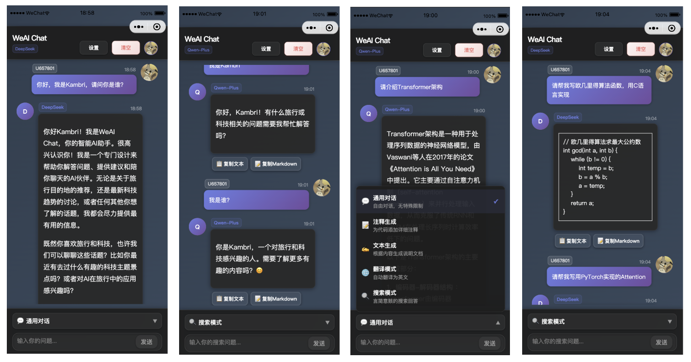

# WeAI Chat: An open-source lightweight AI chat WeChat Mini Program

一个基于微信小程序的AI对话应用，支持多种AI模型，提供智能对话服务。

<div align="center">
  <a href="https://github.com/KaigeZheng/WeAI-Chat">
    
  </a>
</div>


## Software Features

- ✨ **简洁美观的UI设计** - 采用现代化渐变背景和GUI
- ✨ **流畅的对话体验** - 支持实时消息发送和接收
- ✨ **多AI服务支持** - 支持阿里百炼Qwen-Plus和DeepSeek模型

## Interface Preview




## Files Structure

```zsh
WeAI-Chat/
├── app.js                  # 应用入口文件
├── app.json                # 应用配置文件
├── app.wxss                # 应用全局样式
├── components/             # 自定义组件
│   ├── navigation-bar/     # 导航栏组件
│   │   ├── navigation-bar.js
│   │   ├── navigation-bar.json
│   │   ├── navigation-bar.wxml
│   │   └── navigation-bar.wxss
│   └── wemark/            # Markdown渲染组件
│       └── wemark/        # 组件核心文件
│           ├── wemark.js      # 组件主逻辑
│           ├── wemark.wxml    # 组件模板
│           ├── wemark.wxss    # 组件样式
│           ├── wemark.json    # 组件配置
│           ├── parser.js      # Markdown解析器
│           ├── remarkable.js  # Markdown渲染引擎
│           ├── richtext.js    # 富文本处理
│           ├── prism.js       # 代码高亮
│           └── prism.wxss     # 代码高亮样式
├── config/
│   └── api.js              # API配置文件
├── imgs/                   # 图片资源
│   └── cover.jpg           # 项目封面图
├── pages/                  # 页面文件
│   ├── index/              # 主聊天页面
│   │   ├── index.wxml      # 页面结构
│   │   ├── index.wxss      # 页面样式
│   │   ├── index.js        # 页面逻辑
│   │   └── index.json      # 页面配置
│   ├── settings/           # 设置页面
│   │   ├── settings.wxml   # 设置页面结构
│   │   ├── settings.wxss   # 设置页面样式
│   │   ├── settings.js     # 设置页面逻辑
│   │   └── settings.json   # 设置页面配置
│   └── user/               # 用户页面
│       ├── user.wxml       # 用户页面结构
│       ├── user.wxss       # 用户页面样式
│       ├── user.js         # 用户页面逻辑
│       └── user.json       # 用户页面配置
├── project.config.json     # 项目配置文件
├── project.private.config.json # 私有配置文件
├── sitemap.json            # 站点地图配置
└── README.md               # 项目说明文档
```

## TODOLIST

### Features

- [ ] 支持更多模型

- [ ] 支持文生图模型

- [ ] 支持渲染数学公式

- [x] 支持上下文窗口

- [x] 支持常用提示词

- [x] 支持夜间模式

## Update History

### v1.4.4

* 🛠️ 完善GUI以增强与微信小程序界面的适配性
* 🛠️ 修复模型API调用bug（禁用流式API调用）
* 🎉 **微信小程序上线版本**

### v1.4.3

* 🛠️ 修复阿里百炼流式API内容解析问题
* 🔧 改进API测试功能的可靠性
* 📝 增强错误处理和日志输出

### v1.4.2

* 🛠️ 修复API测试连接问题
* 🛠️ 修复消息解析格式问题
* 🎨 优化GitHub按钮夜间模式显示
* 🔗 添加GitHub仓库访问功能

### v1.4.1

- 🛠️ 修复个性化设置UI bug

### v1.4.0

- 🛠️ 修复 UI bug  
- 🎨 UI 优化  
- 🌟 添加对话模式  
- 📋 支持文本复制和Markdown复制  
- ⚙️ 支持个性化设置

### v1.3.1

- 😊 支持显示模型和用户ID

### v1.3.0

- 💬 支持上下文

### v1.2.0

- 🌃 支持夜间模式

### v1.1.0

- ⭐ 支持markdown渲染

### v1.0.0

- 🎉 初始版本发布
- 🤖 支持Qwen-Plus和DeepSeek
- 💬 基础聊天功能
- ⚙️ 设置管理功能

## Cite

使用[wemark](https://github.com/TooBug/wemark)组件以支持markdown渲染

## Contribution

本项目采用MIT开源协议，欢迎提交Issue和Pull Request来改进这个项目！ 
